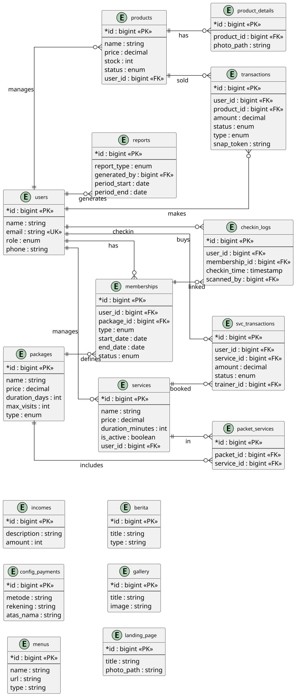

# ERD - Bugar Sehat

Entity Relationship Diagram sistem **Bugar Sehat**, dibagi berdasarkan role pengguna.

---

## 1. ERD Owner & Staff

Diagram ini mencakup tabel-tabel yang dikelola oleh **Owner** dan **Staff**: master data, paket & membership, transaksi, check-in, laporan, konfigurasi, dan landing page.

### Ringkasan Tabel - Owner & Staff

| Kategori | Tabel |
|---|---|
| Master Data | users, products, product_details, services |
| Paket & Membership | packages, packet_services, memberships |
| Transaksi | transactions, svc_transactions |
| Check-in | checkin_logs |
| Laporan | reports, incomes |
| Konfigurasi | config_payments, menus |
| Landing Page | berita, gallery, landing_page |

---

## 2. ERD Trainer & Member

Diagram ini mencakup tabel-tabel operasional **Trainer** dan **Member**: jadwal, booking, progress latihan, sesi layanan, check-in, dan riwayat.

```plantuml
@startuml ERD_Trainer_Member
skinparam linetype ortho
skinparam classAttributeIconSize 0
skinparam classFontSize 11
skinparam dpi 150
left to right direction

entity "users" as users {
  * id : bigint <<PK>>
  --
  name : string
  email : string <<UK>>
  role : enum
  phone : string
}

entity "memberships" as memberships {
  * id : bigint <<PK>>
  --
  user_id : bigint <<FK>>
  package_id : bigint <<FK>>
  type : enum
  start_date : date
  end_date : date
  status : enum
}

entity "packages" as packages {
  * id : bigint <<PK>>
  --
  name : string
  price : decimal
  duration_days : int
  type : enum
}

entity "mbr_products" as mbr_products {
  * id : bigint <<PK>>
  --
  membership_id : bigint <<FK>>
  product_id : bigint <<FK>>
  quantity : int
}

entity "trainer_members" as trainer_members {
  * id : bigint <<PK>>
  --
  trainer_id : bigint <<FK>>
  member_id : bigint <<FK>>
}

entity "availability" as availability {
  * id : bigint <<PK>>
  --
  trainer_id : bigint <<FK>>
  day_of_week : string
  start_time : string
  end_time : string
}

entity "progress" as progress {
  * id : bigint <<PK>>
  --
  trainer_id : bigint <<FK>>
  member_id : bigint <<FK>>
  date : date
  progress_note : text
}

entity "schedules" as schedules {
  * id : bigint <<PK>>
  --
  trainer_id : bigint <<FK>>
  title : string
  start_time : string
  end_time : string
  capacity : int
  service_id : bigint <<FK>>
}

entity "bookings" as bookings {
  * id : bigint <<PK>>
  --
  user_id : bigint <<FK>>
  schedule_id : bigint <<FK>>
  status : enum
}

entity "services" as services {
  * id : bigint <<PK>>
  --
  name : string
  price : decimal
  duration_minutes : int
  is_active : boolean
}

entity "svc_transactions" as svc_transactions {
  * id : bigint <<PK>>
  --
  user_id : bigint <<FK>>
  service_id : bigint <<FK>>
  amount : decimal
  status : enum
  trainer_id : bigint <<FK>>
}

entity "svc_sessions" as svc_sessions {
  * id : bigint <<PK>>
  --
  svc_trx_id : bigint <<FK>>
  session_number : int
  topic : string
  status : enum
  trainer_id : bigint <<FK>>
}

entity "session_tpl" as session_tpl {
  * id : bigint <<PK>>
  --
  service_id : bigint <<FK>>
  session_number : int
  topic : string
}

entity "checkin_logs" as checkin_logs {
  * id : bigint <<PK>>
  --
  user_id : bigint <<FK>>
  membership_id : bigint <<FK>>
  checkin_time : timestamp
}

entity "checkin_codes" as checkin_codes {
  * id : bigint <<PK>>
  --
  user_id : bigint <<FK>>
  code : string <<UK>>
  expires_at : timestamp
}

entity "trx_history" as trx_history {
  * id : bigint <<PK>>
  --
  user_id : bigint <<FK>>
  transaction_id : bigint <<FK>>
}

entity "mbr_history" as mbr_history {
  * id : bigint <<PK>>
  --
  user_id : bigint <<FK>>
  membership_id : bigint <<FK>>
}

entity "transactions" as transactions {
  * id : bigint <<PK>>
  --
  user_id : bigint <<FK>>
  amount : decimal
  status : enum
  type : enum
}

entity "password_otps" as password_otps {
  * id : bigint <<PK>>
  --
  email : string
  otp : string
}

users ||--o{ trainer_members : "assigns"
users ||--o{ availability : "sets"
users ||--o{ progress : "records"
users ||--o{ schedules : "creates"
services ||--o{ schedules : "for"
schedules ||--o{ bookings : "has"
users ||--o{ bookings : "books"
users ||--o{ memberships : "owns"
packages ||--o{ memberships : "defines"
memberships ||--o{ mbr_products : "includes"
users ||--o{ svc_transactions : "buys"
services ||--o{ svc_transactions : "sold"
svc_transactions ||--o{ svc_sessions : "contains"
services ||--o{ session_tpl : "templates"
users ||--o{ checkin_logs : "checkin"
memberships ||--o{ checkin_logs : "via"
users ||--o{ checkin_codes : "generates"
users ||--o{ trx_history : "history"
transactions ||--o{ trx_history : "ref"
users ||--o{ mbr_history : "tracks"
memberships ||--o{ mbr_history : "ref"
users ||--o{ transactions : "transacts"

@enduml
```

### Ringkasan Tabel - Trainer & Member

| Kategori | Tabel |
|---|---|
| Relasi Trainer-Member | trainer_members |
| Jadwal & Booking | schedules, bookings, availability |
| Progress Latihan | progress |
| Sesi Layanan | svc_sessions, session_tpl |
| Transaksi Member | transactions, svc_transactions |
| Check-in Member | checkin_logs, checkin_codes |
| Membership Member | memberships, packages, mbr_products |
| Riwayat | trx_history, mbr_history |
| Autentikasi | password_otps |
